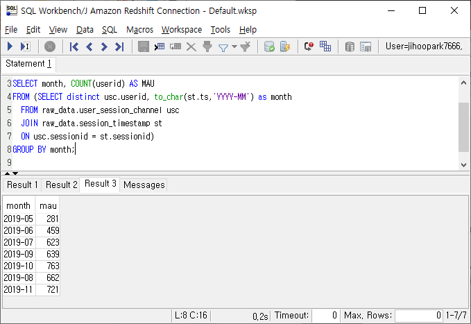

## Assignments 1 

```
가상의 데이터 인프라 구축해보기 (No Coding)
raw_data: 어떤 데이터들이 복사될 수 있는지?
analytics: 어떤 써머리 테이블들을 만들 수 있을지?
```

저는 서비스로 제가 하는 방치형 모바일 게임을 정했습니다

* raw data 
  1. 계정 정보 (아이디, 닉네임, 가입일, 비정상 이용 여부)
  2. 날짜 별 계정의 로그인 정보 
  3. 날짜 별 게임 랭킹 테이블. 순위, 날짜, 닉네임, 점수, 순위전에 이용한 캐릭터의 등급 (순위를 매기는 랭킹전 모드 한정)
  4. 날짜 별 계정 정보와, 날짜 기준 계정 상태 테이블
     1. 최고 스테이지, 환생 횟수, 광고 시청 수, 로그인 횟수, 최종 로그인 일, 가입 이후 접속한 날짜 횟수, 연속으로 접속한 날짜 횟수, 최근 일주일 접속한 횟수
  5. 결제 기록
  6. 날짜별 회원의 결제 상태 집계 테이블
     1. 날짜별 지금까지 구매한 종류별 재화의 양, 결제 누적액, 당일 결제금액, 30일 결제 금액, 프로모션 여부
  7. Google play 연동된 계정의 업적 테이블
* analytics
  * 날짜 별 게임내 경쟁 모드 순위 집계 테이블
    1. 날짜별 지금까지 점수 누적 , 일주일 합산 순위(재화 획득 기준), 한달 합산 순위
  * 일자별 신규 유저, 액티브 유저, 휴면 유저(미접속 14일 이상) 를 나타내는 테이블 
  * 일자 별 총 결제 금액
  * 어떻게 구성 해야할지 생각이 나지 않아서 거의 예시 그대로 썼습니다. 요약 테이블을 만들 때에는 어떤 것부터 시작해야 하나요? 

## Assignments 2 

```
Monthly Active User 세보기
앞서 주어진 두개의 테이블 (session_timestamp, user_session_channel)을 바탕으로 월별마다 액티브한 사용자들의 수를 카운트한다
여기서 중요한 점은 세션의 수를 세는 것이 아니라 사용자의 수를 카운트한다는 점이다.
결과는 예를 들면 아래와 같은 식이 되어야 한다:
2019-05: 400
2019-06: 500
2019-07: 600
```

#### SQL query

```
FROM (SELECT distinct usc.userid, to_char(st.ts,'YYYY-MM') as month
  FROM raw_data.user_session_channel usc
  JOIN raw_data.session_timestamp st 
  ON usc.sessionid = st.sessionid)
GROUP BY month;
```

#### Result




